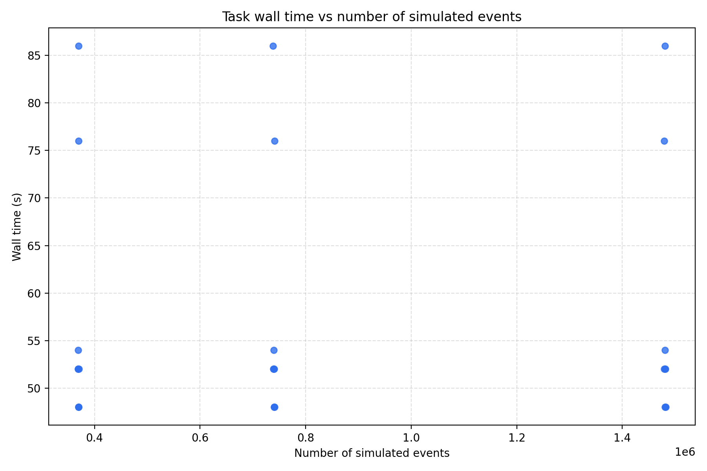
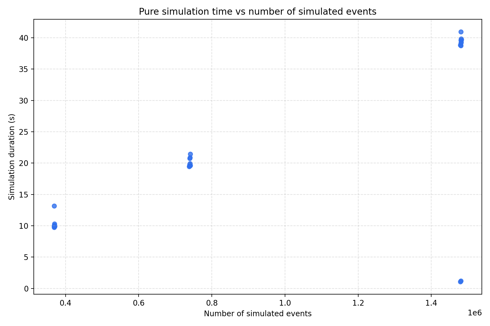

# qmirt-gate-10-sim

GATE 10 Simulation for QMIRT project

## Docker CI/CD

GitHub Actions builds the Docker image on pull requests to `main`.
On pushes to `main` and version tags (`v*`), it also publishes the image to:

`ghcr.io/fanghandev/qmirt-gate-10-sim`

## How to use the `sif ` image on OSPool

1. Create `apptainer_cache` directory in your home directory if it does not exist:

```bash
mkdir -p ~/apptainer_cache
```

2. Pull the image from GitHub Container Registry:

```bash
apptainer pull oras://ghcr.io/fanghandev/qmirt-gate-10-sim-sif:v1.0.0
```

3. Move the image to /ospool/ap40/data/username/qmirt-gate-10-sim-sif:

```bash
mv qmirt-gate-10-sim-sif_v1.0.0.sif /ospool/ap40/data/$USER/qmirt-gate-10-sim.sif
```

## SLURM submission helper

Use the helper in [submit_slurm/run_spect_sim_slurm.sh](submit_slurm/run_spect_sim_slurm.sh) to submit brain or cardiac simulations to a SLURM-managed cluster.

### Basic usage

From the repository root:

```bash
./submit_slurm/run_spect_sim_slurm.sh brain --cluster bridges2 --account <project_id> --dry-run
./submit_slurm/run_spect_sim_slurm.sh cardiac --cluster expanse --account <project_id> --dry-run
./submit_slurm/run_spect_sim_slurm.sh brain --cluster eris --dry-run
```

The script:

- auto-detects the cluster from `hostname` when `--cluster` is omitted
- validates supported partitions for the selected cluster
- creates a dated log directory and a per-batch scratch/output directory
- generates a `.sbatch` file and submits it with `sbatch`
- uses the Apptainer image in `submit_slurm/`

### Cluster-specific notes

- `eris`: uses `/scratch/f/fh890` and default partition `normal`
- `expanse`: requires `--account` and uses `/expanse/lustre/projects/${ACCOUNT}/${USER}`
- `bridges2`: uses the system-provided `PROJECT` environment variable when available; `PROJECT` is already the project root path (for example `/ocean/projects/med260005p/fhan1`), so the script uses it directly and does not append `${USER}` again

### Job-array mode (default)

```bash
./submit_slurm/run_spect_sim_slurm.sh brain \
  --job-count 20 \
  --cpus-per-task 4 \
  --time-limit 04:00:00 \
  --mem-gb 16 \
  --account <project_id> \
  --partition RM
```

This submits a SLURM array job and each task runs with its own task ID and output directory.

### Whole-node mode

If you want one task per node with multithreading enabled for the full node, use `--nodes`:

```bash
./submit_slurm/run_spect_sim_slurm.sh brain \
  --cluster bridges2 \
  --account <project_id> \
  --nodes 2
```

This requests whole-node allocation with one task per node and sets `--cpus-per-task` to the node size for GATE multithreading.

### Test mode

```bash
./submit_slurm/run_spect_sim_slurm.sh brain --cluster bridges2 --account <project_id> --test-mode --dry-run
```

This reduces the run to a small pilot configuration suitable for quick validation.

### Sparse brain-SPECT SRM mode

Sparse mode keeps the existing Gate simulation script unchanged. The brain wrapper runs multiple independent simulations, preserving `--num-chunks` inside each invocation to limit Geant4 event-number growth. Each loop writes ROOT files to local scratch, converts them to 1 mm, 1.5 mm, and 2 mm sparse NPZ matrices, copies the NPZ files to shared output, and deletes the intermediate ROOT files.

```bash
bash submit_slurm/run_spect_sim_slurm.sh brain \
  --sparse-srm \
  --num-loops 100 \
  --num-chunks 10 \
  --chunk-duration-s 1 \
  --srm-fov-size-mm 210 \
  --dry-run
```

`--num-loops` controls independent Gate invocations; `--num-chunks` controls timing intervals within each invocation. Final files are `final_srm_1mm.npz`, `final_srm_1p5mm.npz`, and `final_srm_2mm.npz`. For a local non-SLURM test, set `SCRATCH_ROOT`, `OUTPUT_DIR`, `CONTAINER_SIF`, and `SLURM_CPUS_PER_TASK`, then run `bash submit_slurm/wrapper_brain_spect_sim_slurm.sh --sparse-srm`. Detailed setup and cleanup behavior is documented in [submit_slurm/README.md](submit_slurm/README.md).

### Dry-run / inspect generated script

```bash
./submit_slurm/run_spect_sim_slurm.sh brain \
  --cluster bridges2 \
  --account <project_id> \
  --test-mode \
  --dry-run
```

This prints the generated `.sbatch` script without submitting it, so you can confirm the job directives, partitions, and output paths before submitting.

## Running a Bridges2 production campaign with the local monitor

This walks through submitting a sparse brain-SPECT campaign on Bridges2 and watching its progress from a dashboard served on your own machine (or a shared local server on your internal network).

### 0. Test the workflow end-to-end with a small pilot first

Before trusting the pipeline for a full production campaign, validate every stage (submission → sparse SRM → combine → progress report → dashboard) with a cheap, fast pilot:

```bash
./submit_slurm/run_spect_sim_slurm.sh brain \
  --cluster bridges2 \
  --account <project_id> \
  --test-mode \
  --sparse-srm \
  --num-loops 2 \
  --job-count 2 \
  --combine-after
```

or simply:

```bash
./submit_slurm/run_spect_sim_slurm.sh brain \
  --cluster bridges2 \
  --test-mode \
  --sparse-srm \
  --num-loops 2 \
  --job-count 2 \
  --combine-after
```

`--test-mode` shrinks the run to `job-count=2`, `cpus-per-task=4`, `time-limit=0:30:00`, and a low source activity, so it finishes in minutes instead of hours. Once the array job and the combine job both show `COMPLETED` in `squeue`/`sacct`, confirm each stage produced what's expected:

```bash
# on Bridges2, after the jobs finish
ls "$DATA_DIR"                                  # expect task_0/, task_1/, final_srm_*.npz, combined_srm_metadata.json, campaign_manifest.json
cat "$DATA_DIR/campaign_manifest.json"
ls "$DATA_DIR/task_0/srm_chunks"/*_run_manifest.json   # per-loop resolved simulation parameters
python3 payload/python/report_campaign_progress.py \
  --campaign-dir "$DATA_DIR" --expected-tasks 2 --output "$DATA_DIR/progress.json"
python3 -c "import json; json.load(open('$DATA_DIR/progress.json')); print('progress.json OK')"
```

`tasks.complete` in `progress.json` should equal `2` and `srm.<label>.available` should be `true` for each resolution label. Only proceed to steps 1–6 below (or scale up `--job-count`/`--num-loops` for real production) once this pilot's `progress.json` looks correct and the local monitor (step 3–6) renders it without errors.

### 1. Submit the campaign on Bridges2

```bash
./submit_slurm/run_spect_sim_slurm.sh brain \
  --cluster bridges2 \
  --account <project_id> \
  --sparse-srm \
  --job-count 100 \
  --cpus-per-task 8 \
  --time-limit 12:00:00 \
  --num-loops 50 \
  --num-chunks 10 \
  --chunk-duration-s 1.0 \
  --srm-fov-size-mm 210 \
  --combine-after \
  --combine-groups 10 \
  --auto-report \
  --report-interval-s 60
```

Drop `--dry-run` only after you've inspected the generated `.sbatch` file. Note the printed `DATA_DIR` (campaign output directory on Bridges2's `$PROJECT` scratch) and the `Submitted array job <ARRAY_JOB_ID>` line — you'll need both for the next step.

Every submission also writes a `campaign_manifest.json` (to both the log directory and `DATA_DIR`) recording the exact repo git commit, container SIF path/SHA-256, and every resolved scheduler/simulation parameter for that batch — this is the record to keep for reproducing or auditing a production run later. Each individual Gate invocation additionally writes its own `a_<job_id>_j_<task_id>[_loop_<loop_id>]_run_manifest.json` next to its stats file, capturing the fully resolved Python simulation parameters (including the random seed) actually used for that invocation; in sparse-SRM mode these end up under `task_<id>/srm_chunks/` alongside the per-loop stats and SRM chunks.

### 2. Generate a progress JSON on Bridges2

`--auto-report` above submits its own small, independent Slurm job (not a login-node process — login nodes typically kill or discourage long-running background processes) that regenerates `"$DATA_DIR/progress.json"` every `--report-interval-s` seconds. By default it requests `--report-cpus 1 --report-mem-gb 2 --report-time-limit 24:00:00` on the same partition as the main job (override with `--report-partition`); increase `--report-time-limit` for campaigns expected to run longer than 24 hours. It uses `sacct`/`squeue` on the array job for queue/run timing, and stops itself (after one final refresh) once the last stage of the pipeline (the combine job, if `--combine-after` was used) leaves the queue — so its own time limit only needs to be a safety cap, not an exact estimate. Its sbatch file and `%j.out`/`%j.err` logs are under `<LOG_DIR>`, printed in the submission summary as `Submitted progress reporter job <REPORT_JOB_ID>`.

If you didn't pass `--auto-report`, or want an ad hoc refresh, run the same report generator directly on the login node instead:

```bash
python3 payload/python/report_campaign_progress.py \
  --campaign-dir "$DATA_DIR" \
  --expected-tasks 100 \
  --job-id <ARRAY_JOB_ID> \
  --output "$DATA_DIR/progress.json"
```

You can also (re-)submit the same reporter job manually (e.g. to re-attach monitoring to an already-running campaign) with `sbatch --wrap='bash submit_slurm/wrapper_generate_progress_report.sh --campaign-dir "$DATA_DIR" --expected-tasks 100 --job-id <ARRAY_JOB_ID> --watch-job-id <ARRAY_JOB_ID> --output "$DATA_DIR/progress.json" --interval-s 60' --cpus-per-task=1 --mem=2G --time=24:00:00 --partition=<partition>`.

**How concurrent writes to `progress.json` are avoided:** `report_campaign_progress.py` always writes to `progress.json.tmp` and then atomically renames it into place, so anything reading the file (the monitor, `cat`, `scp`) only ever sees a complete, valid JSON document — never a half-written one. That alone doesn't stop two *writer* processes from racing each other, though, so `wrapper_generate_progress_report.sh` additionally takes an `flock` lock on `<output>.reporter.lock` for as long as it runs: if a second reporter job is accidentally submitted for the same `--output` path, it prints an error and exits immediately instead of corrupting the file. A one-off manual `report_campaign_progress.py` run (not through the wrapper) isn't locked, so avoid running that by hand against the same output path while a reporter job is also active. Since every campaign gets its own `progress.json`/lock file under its own `DATA_DIR`, running several campaigns at once is safe — their reporter jobs never contend with each other.

### 3. Serve the dashboard from your local server

Run `serve_monitor.py` inside a `screen` session on the local server so it keeps running after you disconnect, without needing a systemd unit:

```bash
screen -S srm-monitor
python3 monitor/serve_monitor.py \
  --host 127.0.0.1 --port 8765 \
  --ssh-host <bridges2-user>@data.bridges2.psc.edu \
  --remote-json "$DATA_DIR/progress.json" \
  --interval-s 30
```

Detach with `Ctrl-A` then `D` (the process keeps running). To check on it or stop it later:

```bash
screen -ls                 # list sessions, confirm "srm-monitor" is there
screen -r srm-monitor       # reattach
# inside the session: Ctrl-C to stop the server, then `exit` to close the session
```

If the server reboots, the `screen` session won't survive — you'll need to start it again the same way; there's no auto-restart unless you add one (e.g. a `@reboot` crontab entry running the same `screen -dmS srm-monitor python3 monitor/serve_monitor.py ...` command).

Binding to `127.0.0.1` keeps the raw dev server off the network; only your reverse proxy (next step) should be reachable externally. This requires passwordless SSH (an `ssh-agent`/key pair) from the local server to Bridges2's data-transfer node, since it re-runs `ssh <bridges2-user>@data.bridges2.psc.edu "cat ..."` on every poll. Using `data.bridges2.psc.edu` (rather than the interactive login node) is PSC's intended host for repeated automated file transfers, and keeps this polling off the login node entirely.

To test just this step with the step-0 pilot's `progress.json` before wiring up SSH, `scp` it down and point `serve_monitor.py` at the local copy first:

```bash
scp <bridges2-user>@data.bridges2.psc.edu:"$DATA_DIR/progress.json" /tmp/pilot_progress.json
python3 monitor/serve_monitor.py --host 127.0.0.1 --port 8765 --local-json /tmp/pilot_progress.json
curl -s http://127.0.0.1:8765/api/progress | python3 -m json.tool | head -20
```

If that renders correctly (open `http://127.0.0.1:8765` in a browser on the local server), switch to `--ssh-host`/`--remote-json` for live polling as shown above.

### 4. Put nginx in front with HTTPS

Add an nginx site that redirects `80 → 443` and reverse-proxies to the local `127.0.0.1:8765` monitor:

```bash
sudo mkdir -p /etc/nginx/ssl
# copy a cert/key pair to /etc/nginx/ssl (self-signed for internal testing,
# or one issued by your institution's internal CA for a warning-free experience)
sudo cp /etc/nginx/sites-available/srm-monitor /etc/nginx/sites-available/srm-monitor  # edit server_name for your host
sudo ln -s /etc/nginx/sites-available/srm-monitor /etc/nginx/sites-enabled/srm-monitor
sudo nginx -t && sudo systemctl reload nginx
```

See [monitor/README.md](monitor/README.md) for the exact `server { ... }` blocks (HTTP→HTTPS redirect plus the `proxy_pass http://127.0.0.1:8765;` block) and the detector pixel-mapping conventions the dashboard uses.

### 5. Open the firewall

```bash
sudo ufw allow 443/tcp
sudo ufw allow 80/tcp   # needed for the redirect to 443 to be reachable at all
sudo ufw status verbose
```

Confirm `8765/tcp` is **not** in the allow list — it should only be reachable via nginx on `127.0.0.1`, not directly from the network.

### 6. View it

Browse to `https://<your-local-server-hostname>` from a machine on the same internal network/VPN. The dashboard polls `/api/progress` every 15 seconds and reflects whatever `report_campaign_progress.py` last wrote to `progress.json` on Bridges2.

## 40 trillion-event simulation plan

The long-run goal is to reach a total of $4 \times 10^{13}$ simulated events. This is not a single-job target; it must be treated as a staged campaign built from many independent array chunks.

### ERIS partition policy

The exact scheduler output from ERIS is:

| Partition | Max job duration    | Total CPUs | Total nodes | Default | Notes                                          |
| --------- | ------------------- | ---------: | ----------: | ------- | ---------------------------------------------- |
| `normal`  | 1-00:00:00 (1 day)  |        768 |           8 | Yes     | Default partition for most jobs                |
| `long`    | 7-00:00:00 (7 days) |       1360 |          17 | No      | Recommended for compute jobs longer than 1 day |
| `bigmem`  | 2-00:00:00 (2 days) |       2184 |          23 | No      | Reserved for large-memory jobs                 |
| `debug`   | 00:30:00 (30 min)   |         80 |           1 | No      | Intended for short tests and debugging         |

The `interactive` partition was not included in the exact scheduler output you shared, so the scheduler-confirmed values above are the ones to rely on for job planning. The key point is that the scheduler reports the real total CPU and node capacity directly, not an approximate table.

This policy affects the plan in two ways:

- do not ask for a job time that exceeds the partition limit
- choose the partition before sizing the run, because the total node and CPU capacity constrain how much work can be launched in one job

### Critical constraint: GATE event counter overflow

GATE uses a 32-bit integer for event counts in some internal structures. That means a single long run can overflow if the number of events in one simulation exceeds the safe range for that counter. In practice, long simulations should not try to accumulate all events in a single run.

This is why the required operational rule is:

- do not run a single job beyond a chunk size that is safely below the 32-bit event limit
- use many short chunks and accumulate totals across many independent tasks
- validate each chunk before moving to the next stage

For planning purposes, the chunk size should be chosen conservatively so that it is well below the overflow threshold even under the largest realistic event count for a task.

### Recommended strategy

1. Benchmark first with a small pilot run.
   - Measure throughput in events/sec.
   - Measure wall time, output size, memory use, and failures.
   - Run on a small subset of tasks before scaling.

2. Use chunked array jobs rather than one massive job.
   - Each array task should produce a moderate number of events, for example $10^8$ to $10^9$ events per task when the runtime is stable.
   - The full campaign then becomes:

   $$
   \text{required tasks} = \frac{4 \times 10^{13}}{\text{events per task}}
   $$

3. Keep each chunk comfortably below the GATE overflow limit.
   - Use many short chunks instead of a single long run.
   - If the simulation produces a large number of events per second, reduce the chunk size so that a task never approaches the 32-bit event counter boundary.
   - The overflow risk is the main reason to prefer numerous short batch segments.

4. Keep task durations short enough to recover from failures and to remain within partition policy.
   - Avoid very long single-task jobs unless throughput has already been benchmarked and the chunk size has been explicitly checked against the event counter bound.
   - Prefer many moderate chunks over a single fragile run.
   - Use `normal` for routine work, `long` only for jobs that genuinely require >1 day, and reserve `bigmem` for jobs that require the large-memory node class.

5. Use ERIS defaults consistent with the available partitions.
   - Default partition: `normal`
   - Other valid partitions: `long`, `bigmem`, `interactive`, `debug`
   - Start with `normal` for production jobs; use `long` only when your measured runtime exceeds 1 day and the requested memory fits the node profile.

6. Use `/scratch/f/fh890` as the batch staging area.
   - Output layout should follow:

   ```bash
   /scratch/f/fh890/<sim_name>/<batch_id>
   ```

   - Example: `brain_spect_sim` or `cardiac_spect_sim`.

7. Validate each batch before expanding.
   - Check event totals, output file counts, root-file integrity, timing metadata, and task completion.
   - Re-run only failed chunks instead of restarting the entire campaign.

### Suggested execution flow

1. Run a dry-run first to inspect the generated batch script:

```bash
./submit_slurm/run_spect_sim_slurm.sh brain \
  --job-count 5 \
  --cpus-per-task 1 \
  --time-limit 01:00:00 \
  --mem-gb 4 \
  --partition normal \
  --source-activity-bq 3.7e5 \
  --chunk-duration-s 1.0 \
  --num-chunks 10 \
  --dry-run
```

2. Run a short pilot batch without dry-run:

```bash
./submit_slurm/run_spect_sim_slurm.sh brain \
  --job-count 20 \
  --cpus-per-task 1 \
  --time-limit 04:00:00 \
  --mem-gb 4 \
  --partition normal \
  --source-activity-bq 3.7e5 \
  --chunk-duration-s 1.0 \
  --num-chunks 10
```

3. Read the per-task sim stats and confirm the event count per chunk stays safely below the overflow threshold.
4. Scale up the number of tasks while reducing each chunk size if needed.
5. Repeat until the total campaign reaches the $4 \times 10^{13}$ event goal.

### How to decide how many CPUs you can request

The cluster policy is node-based, not just CPU-based. The safe rule is:

- check the partition limits first
- then request no more CPUs than the partition allows per node
- and do not assume you can request more than the node can provide in one job

For this cluster, the exact scheduler values are:

- `normal`: 768 CPUs total across 8 nodes, MaxTime 1 day
- `long`: 1360 CPUs total across 17 nodes, MaxTime 7 days
- `bigmem`: 2184 CPUs total across 23 nodes, MaxTime 2 days
- `debug`: 80 CPUs total on 1 node, MaxTime 30 minutes

So a practical rule is:

$$
\text{total requested CPUs} \le \text{partition total CPUs}
$$

and, for a job that requests multiple nodes, you should also keep the request within the scheduler’s node and user limits. The scheduler output is the authoritative source; in this case, `scontrol show partition ...` is the correct way to determine the exact capacity.

In this project, we generally default to `cpus-per-task=1` because the workflow is dominated by many independent array tasks rather than a single large multithreaded job. That is the simplest way to keep throughput and chunking under control while staying comfortably inside the cluster policy.

### Operational guidance

- Use `--dry-run` before every new campaign configuration.
- Prefer `cpus-per-task=1` unless a benchmark shows a clear benefit to using more.
- Keep a log of batch IDs, task counts, event totals per chunk, runtime, output directories, and seed state to support restart and debugging.
- Keep the full campaign in independent batches so each stage can be validated and archived separately.
- Treat chunking as a safety requirement, not just a convenience.
- Check the partition policy before choosing the job time, memory, and CPU request.

### Summary

The 40-trillion-event target should be approached as a large, validated campaign of many short, independent, overflow-safe chunks. The main design constraint is the GATE 32-bit event counter limit, and the operational constraints are the ERIS partition limits on runtime, memory, and CPUs. The correct plan is: choose the partition, keep each chunk safely below the overflow threshold, and scale the number of array tasks without exceeding the node-level CPU policy.

### Suggested execution flow

1. Run a dry-run first to inspect the generated batch script:

```bash
./submit_slurm/run_spect_sim_slurm.sh brain \
  --job-count 5 \
  --cpus-per-task 1 \
  --time-limit 01:00:00 \
  --mem-gb 4 \
  --partition normal \
  --source-activity-bq 3.7e5 \
  --chunk-duration-s 1.0 \
  --num-chunks 10 \
  --dry-run
```

2. Run a short pilot batch without dry-run:

```bash
./submit_slurm/run_spect_sim_slurm.sh brain \
  --job-count 20 \
  --cpus-per-task 1 \
  --time-limit 04:00:00 \
  --mem-gb 4 \
  --partition normal \
  --source-activity-bq 3.7e5 \
  --chunk-duration-s 1.0 \
  --num-chunks 10
```

3. Measure throughput and adjust the per-task target.
4. Submit a larger batch with the tuned values.
5. Repeat until the total campaign reaches the $4 \times 10^{13}$ event goal.

### Operational guidance

- Use `--dry-run` before every new campaign configuration.
- Prefer `cpus-per-task=1` unless a benchmark shows a clear benefit to using more.
- Keep a log of batch IDs, task counts, runtime, output directories, and seed state to support restart and debugging.
- Keep the full campaign in independent batches so each stage can be validated and archived separately.

### Summary

The safest path is to treat 40 trillion events as a validated campaign of many independent simulation chunks, not one run. Benchmark the per-task throughput, choose a stable event budget, and scale the number of array tasks until the cumulative total reaches the target.

### Runtime analysis plots from collected task logs

The following plots were generated from:

- `results/brain_spect/brain_spect_runtime_summary.csv`

Dataset summary used for captions:

- Tasks: 30
- Total simulated events: 25,905,360
- Events per task range: 369,016 to 1,482,372
- Mean pure simulation duration: 20.74 s (median 19.62 s)
- Mean wall time: 56.8 s (median 52.0 s)
- Mean overhead (wall - pure simulation): 36.06 s (median 32.85 s)
- Mean event rate: 35,825 events/s (median 37,370 events/s)
- 2 outlier tasks show very short pure simulation durations (<5 s)

#### Task wall time vs number of simulated events



Caption: Across 30 tasks, wall time clusters around 48 to 54 s for most points and extends to 76 to 86 s in slower cases, while event counts span 369k to 1.48M. The mean wall time is 56.8 s (median 52.0 s), indicating a substantial near-fixed overhead component compared with pure simulation time.

#### Pure simulation time vs number of simulated events



Caption: Pure simulation duration scales approximately linearly with events in three visible clusters (~370k, ~740k, ~1.48M events), with mean 20.74 s and median 19.62 s. Two short-duration outliers (~1.05 s and ~1.22 s at ~1.48M events) are present and should be treated as anomalous when fitting production throughput.

```bash
./submit_slurm/run_spect_sim_slurm.sh brain \
  --job-count 400 \
  --cpus-per-task 1 \
  --time-limit 1-00:00:00 \
  --mem-gb 4 \
  --partition long \
  --source-activity-bq 2e7 \
  --chunk-duration-s 1.0 \
  --num-chunks 100
```

Event Rate: ~36,000 events/s per job (single-threaded, 1 CPU per job), 400 jobs in parallel, total throughput $\sim 14.4 \times 10^6$ events/s across the cluster.

ETA: 55555.6 seconds (approximately 15.4 hours) for 400 tasks, 16 to 20 hours.
Event per batch: 400 tasks $\times$ 100 chunks $\times 2\times 10^7$ events = $$8 \times 10^{11}$$ events
Total number of batches to reach $4 \times 10^{13}$ events: $50$ batches

### Running on the PSC Bridges2 cluster

#### Estimated throughput and time for a 40 trillion-event campaign

Each node has 128 CPUs, and in this set up we should be able to simulated $\sim 20$ billion events per node per job, each job should be able to finish in $\sim 3$ hours. Each batch can run 32 jobs in parallel, we will need to run about 63 batchs. That is a total of $\sim 189$ hours, or $\sim 8$ days to finish the whole campaign.

#### Disk space considerations

Each job will produce a single output root file, and the size of each output file is $\sim 2.5$ GB. Each batch will produce 32 output files, that is $\sim 80$ GB per batch. The total output size for the whole campaign will be $\sim 5$ TB. Make sure you have enough disk space to store the output files.

#### Split 2000 jobs into 4 campaigns

Do the following for 4 times.

```bash
./run_spect_sim_slurm.sh brain --cluster bridges2 --job-count 500 --cpus-per-task 128 --concurrent-limit 32 --source-activity-bq 6.25e6 --chunk-duration-s 1.0 --num-chunks 25
```
